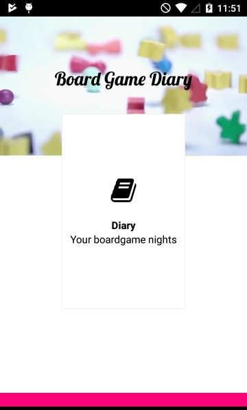

# Board Game Diary app
## Keep track of your game nights

In the app you can keep track of all your game nights and save the games you've played with your friends, give the night a rating and add an image.

App was created for the Twitch Hackalong at https://hackalong.devpost.com/

Developed in JavaScript with [Axway Apccelerator](http://appcelerator.com/).

**Hack time:** around 7 hours 30min (was late to the game :smile: )

**Features:**
* add/remove game night events
* add players (from a list)
* add games (from a list)
* add an image
* rate the game night
* write a text about it
* see an overview of all your game nights
* detail page

* cross platform app (but only for Android now since I'm on linux)
* using models/data-binding to save the data

**Todo:**
* Clean up everything (some TODOs in the code)
* better layout
* more features besides the diary part
* much more :smile:
